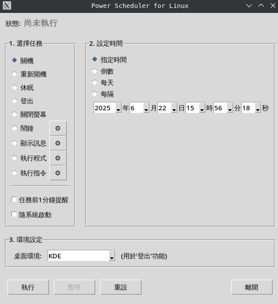
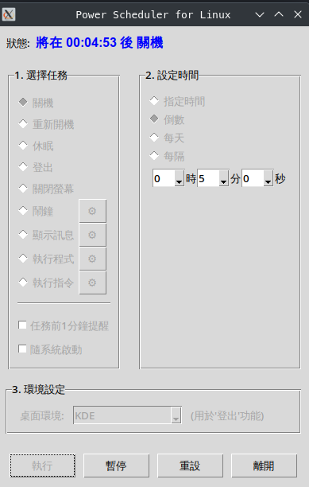

# Power Scheduler for Linux - Tkinter

A graphical tool built with Python and Tkinter, designed specifically for Linux desktop environments,
allowing you to easily schedule various system tasks such as scheduled shutdown, reboot, alarm reminders, etc.

This project is a reimplementation of the previously created [Power-Auto-Shutdown](https://github.com/twtrubiks/Power-Auto-Shutdown) using Python Tkinter.
The entire project was almost completed using AI. After testing it myself, there should be no issues.

## Application Screenshots

Interface



Running



1-Minute Pre-Task Notification


Scheduled Time Reached


-----

## Features

  - **Multiple Scheduling Modes**:
      - **Specific Time**: Execute a task at a specific year, month, day, hour, minute, and second.
      - **Countdown**: Execute a task after a certain period of time.
      - **Daily**: Execute a task at a fixed time every day.
      - **Interval**: Repeat a task at regular intervals.
  - **Rich Task Options**:
      - **System Operations**: Shutdown, Reboot, Suspend.
      - **Desktop Environment Operations**: Logout (supports KDE, GNOME, XFCE).
      - **Screen Operations**: Turn off the screen immediately.
      - **Alarm**: Play a sound and display a reminder window at a specific time.
      - **Display Message**: Pop up a message box with custom content.
      - **Execute Program**: Run any application or script you specify.
      - **Execute Command**: Run a custom Shell command.
  - **User-Friendly Design**:
      - **Pre-Task Reminder**: Option to show a reminder 1 minute before the task executes.
      - **Start with System**: Easily configure whether to automatically run this program on boot.
      - **Status Display**: Clearly shows the current task status and remaining time.
      - **Pause/Resume**: Pause or resume an ongoing countdown task at any time.
      - **Auto-Detect Desktop Environment**: Automatically selects the appropriate command for the "Logout" function.
      - **Security**: For system operations requiring administrator privileges (like shutdown), it securely requests authorization via `pkexec`.

-----

## Dependencies and Installation

This program primarily depends on Python 3.12 and its built-in Tkinter library. Additionally, some features require specific command-line tools to be installed on the system.

### Required Dependencies

  - **Python 3**: Most Linux distributions come with it pre-installed.
  - **Tkinter**: The standard Python interface to the Tk GUI toolkit. `pip install tkinter`
  - **pkexec**: Part of Polkit, used to request administrator privileges, usually pre-installed on the system.

### Optional Dependencies (Based on features you use)

  - **ffplay**: Used by the "Alarm" feature to play sound. `ffplay` is part of the `ffmpeg` package.
    ```bash
    # Debian/Ubuntu
    sudo apt-get install ffmpeg

    # Fedora
    sudo dnf install ffmpeg

    # Arch Linux
    sudo pacman -S ffmpeg
    ```
  - **xset**: Used for the "Turn off screen" feature. Usually provided by `xorg-xinit` or similar packages, and most desktop environments have it installed.

-----

## How to Use

  - Run the application
    ```bash
    python3 power_scheduler.py
    ```
  - Set up a task:
      - **1. Select Task**: Choose a task you want to perform from the left-side list. For tasks like "Alarm" or "Display Message", you can click the ⚙️ button on the right for detailed settings.
      - **2. Set Time**: On the right, select a time mode (Specific Time, Countdown, etc.) and set the desired time.
      - **3. Environment Settings**: The program usually auto-detects your desktop environment. If the "Logout" function doesn't work correctly, you can specify it manually here.
      - **4. Execute**: Click the "Execute" button to start the schedule.

-----

## Feature Details

### Task Types

  - **Shutdown/Reboot/Suspend**: These are system-level operations. When executed, a password prompt will appear to get authorization.
  - **Logout**: Executes the corresponding logout command based on your selected desktop environment (KDE, GNOME, XFCE).
  - **Alarm**: You need to first click the ⚙️ button to select a sound file (e.g., `.mp3`, `.wav`). When the time comes, it will play the sound and pop up a window where you can click "Stop".
  - **Execute Program/Command**:
      - **Execute Program**: Select an executable file or script on your computer.
      - **Execute Command**: Enter a Shell command (e.g., `notify-send "Hello World"` or `cp /path/to/source /path/to/destination`).
        > **Warning**: Executing arbitrary commands can pose a security risk. Please use with caution.

### Start with System

After checking the "Start with System" option, the program will create a `.desktop` file in the `~/.config/autostart/` directory. This will make Power Scheduler start automatically when you log into your desktop environment. Unchecking the option will delete the file.

-----

## Notes

  - **Permission Issues**: Operations like shutdown and reboot require administrator privileges. This program uses `pkexec` to handle this, which will pop up a dialog for you to enter your password. Please ensure Polkit is installed and configured on your system.
  - **Wayland Environment**: Under the Wayland display server, the "Turn off screen" feature (`xset`) may not work. This is a limitation of the `xset` tool itself.
  - **Command Security**: The "Execute Command" feature is very powerful but also comes with risks. Do not execute commands from unknown sources or whose effects you do not understand.

-----

## License

This project is licensed under the [MIT License](LICENSE)